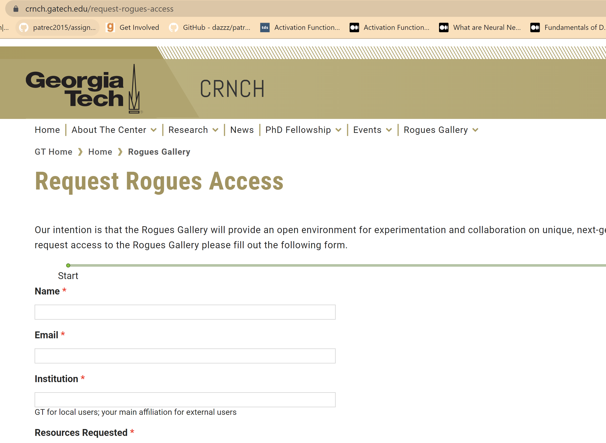
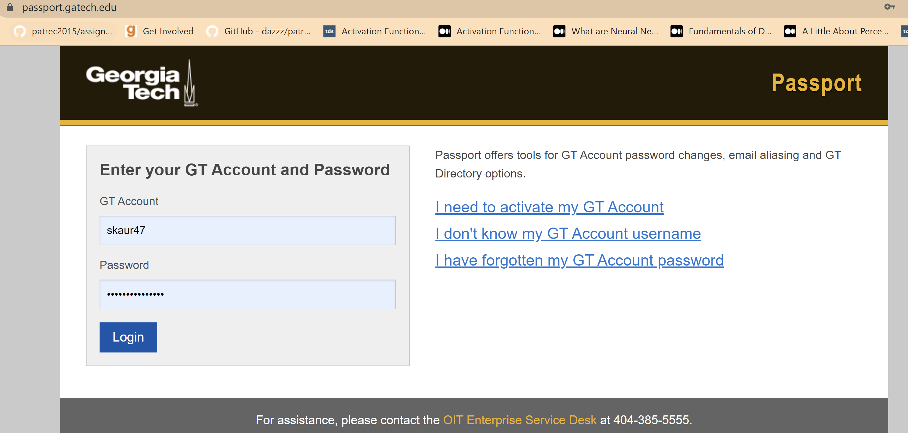
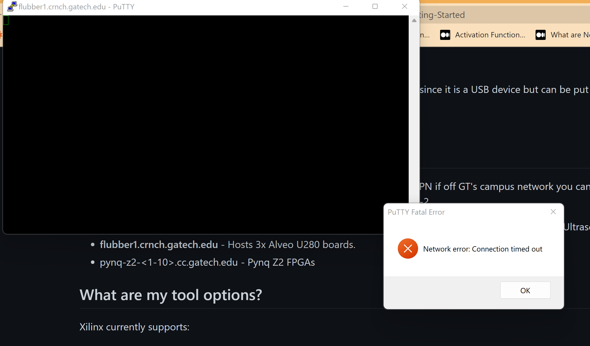
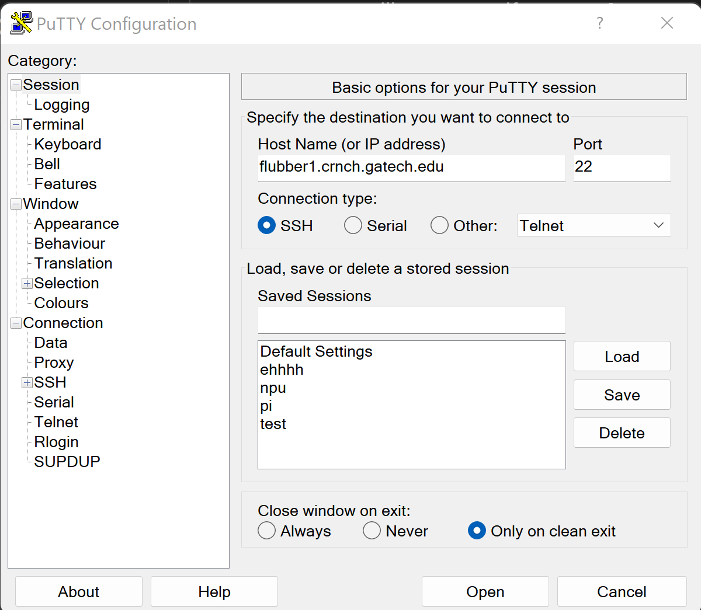
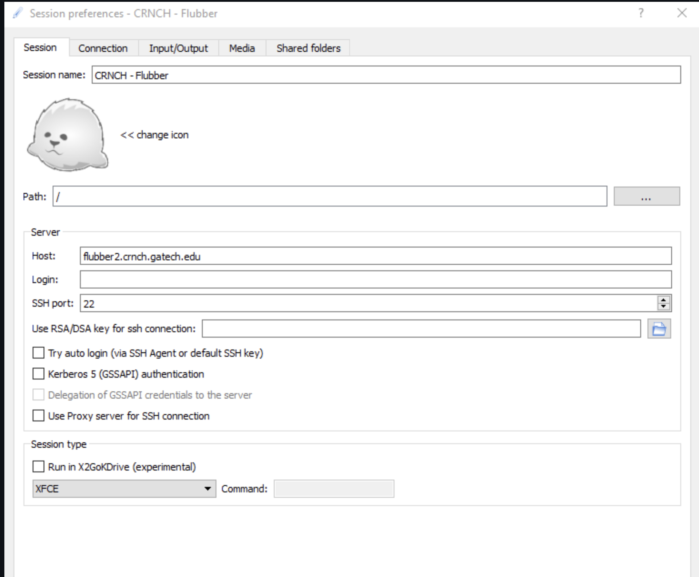
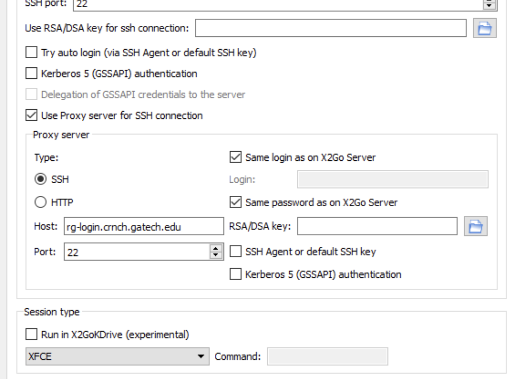
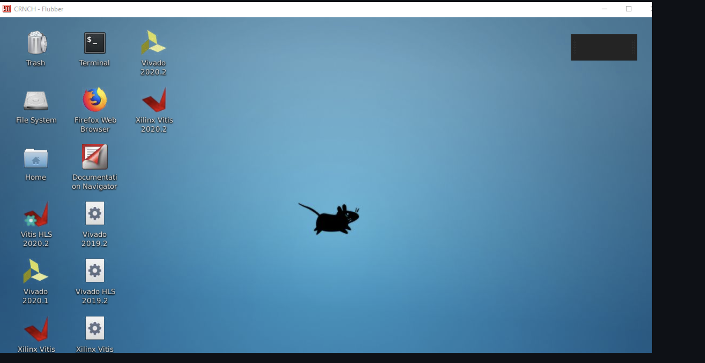

# CRNCH Rogues Gallery for FPGA

## Documented by: Simrat Kaur ( skaur4@hawk.iit.edu )   |    Dated: July 26, 2022

## Georgia TEch launched its own testbed platform named as CRNCH Rogues Gallery testbed, for Reconfigurable Computing, Quantum and Neuromorphic computing etc. HAve a detailed here: https://crnch.gatech.edu/rg

1. ### Getting Started
First step is to request for access onto their testbed by filling out a simple form here: https://crnch.gatech.edu/request-rogues-access

2. ### Access to Georgia Tech
   You will recieve an email for your GA Guest account created and it will contain links and username and password access to the GA Tech 'passport' login. 

   

3. ### Github Documentation
   Once you login to the GA tech passport account, you can access their testbed documentation on github at https://github.gatech.edu/crnch-rg

4. ### FPGA Documentation 
   Look for '[Reconfig] Xilinx FPGAs Getting Started' and follow the steps mentioned to login to your VM. 

5. You dont need to create extensive custom instatiations as for OCT. There are 3 different nodes for FPGAs depending upon your hardware useage. You have Pynq Z2 FPGAs, Ultrascale SoCs and 3 Alveo 280 Data center cards. 

- rg-fpga-cubed.crnch.gatech.edu - The Pico Computing SC6 system contains HMC memory and Xilinx Ultrascale chips.
- flubber1.crnch.gatech.edu - Hosts 3x Alveo U280 boards.
- pynq-z2-<1-10>.cc.gatech.edu - Pynq Z2 FPGAs

You can use these directly into your PuTTY terminal of your local system to access the board you require. 
* Recurrent Error Message:  GAtech testbed responds very slow and can be highly unpreditable since it is still in its early stages and lacks documentation/Support. 
* THe connection takes time and you can see time-out messages like this one frequently. 
* 

6. Another point to keep in mind is when you ssh into the VM (Let's say, you are using for Alveo card), access via flubber1.crnch.gatech.edu at port 22. Then once you get in, login with your GA Tech passport username and password and you will get access. 
   if you try - 
   [username]@flubber1.crnch.gatech.edu directly on PuTTY (or any other ssh terminal) - it does not work. 

7. The VM already contains the Xilinx EDA tools like Vitis/ HLs on it. To start vitis, check this :

8. To access the GUI on CRNCH Rogues, you can use X2Go. 
   check out their installation guide here: https://wiki.x2go.org/doku.php/doc:installation:start

   For Ubuntu : sudo apt-get install x2goserver x2goserver-xsession
   
   Use your ssh  host and GA tech username and pasword to log in. 
   

9. Unless you are a GA Tech student/staff/faculty, you will have a guest account and for that your need to add proxy settings. 
    
    - 'If you are on not on campus VPN, you need to add the "proxy setting" for the X2go client to use rg-login.crnch.gatech.edu as your login or jump host proxy. Set the proxy to use the same login and password as the x2go server.'

    

10. Once your are done, you can see the GUI access like this: 
    
    

Refernces: 

1. Your main point of contact for CRNCH goes through GA Tech support portal or helpdesk@cc.gatech.edu or you can contact Dr. Jeffery Young at jyoung9@gatech.edu

2. Once you get access, you can use the documentation at Github linked above; like mentioned above, CRNCH is a less supported and at times, unreliable. 

